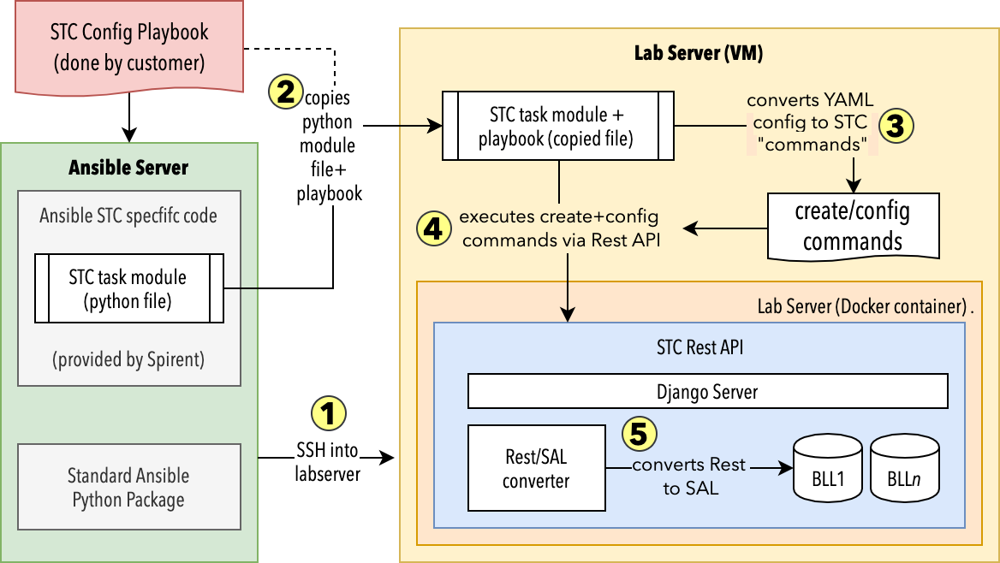

# STC Ansible


This is an *experimental* Ansible plugin to configure STC data-models. 

### Requirement

This STC ansible module requires a recent version (>=2.5) of the Ansible client. 

This STC ansible module can be used to remote configure a lab-server. Configuration of STC-web is currently not supported.

### Installation

First, you need to install the Python depencies for the Ansible client:

```sh
pip install -r requirements.txt
```

### Running and STC playbook

There are several example playbooks in the `playbooks` folder. 
To run all of them, just use `make play`, and it will create an STC session for each of the playbook.

# Ansible Configuration

### Inventory

In your inventory (`inventory.ini`), declare the lab servers you want the ansible playbook to connect to:

```ini
[labservers]
my-labserver-1 ansible_host=10.61.67.200

[labservers:vars]
ansible_connection=paramiko
ansible_host_key_checking=no
ansible_user=admin
ansible_ssh_pass=spirent
ansible_ssh_common_args=/bin/ssh
ansible_paramiko_pty=no
```

Note that `ansible_paramiko_pty` MUST be set to `no` as it will otherwise fail to connect to the Lab Server.

### Ansible STC Module

If you want to use the STC module out-side of this direction, you will need to copy the content of the `module_utils` and `library` into the folder from which you are running your ansible playbook.


# Let's make an STC playbook

### Basic STC ansible actions

The `stc` ansible module makes it possible to execute one of the following 5 actions:

action | description |
-------|-------------|
new_session | Attach to an exist session. If the session does not exsits, a new session is created. If the session exists, the data model is first reset to the default data-model |
load | loads a predefined XML data model. Note that the model must first be copied to the target lab-server using the `copy` module. Check the [datamodel-loader.yaml](playbooks/datamodel-loader.yaml) playbook for reference. |
...|...|
create | creates a new object in the data model
config | configures an existing object in the data model
perform | perform a command agains the data model

### Attach to a session

The first task of the playbook must be to attach to an STC session:

```yaml
- name: Create session
  stc: 
    action: new_session
    user: ansible
    name: datamodel-loader
```

### Create a few ports

You can then declare your own emulated device:

```yaml
- name: Create the base ports
  stc: 
    action: create
    objects: 
      - project: 
          - port: 
              location: "//(Offline)/1/1"
              name: Port 1

          - port: 
              location: "//(Offline)/2/1"
              name: Port 2
```

The STC ansible module has a special iterator construct, which can be used to create several objects in an iterative way. For that, you only need to define the `count` property under `stc`. 

```yaml
- name: Create the 18 ports
  stc: 
    count: 18
    action: create
    objects: 
      - project: 
          - port: 
              location: "//(Offline)/1/${item}"
              name: "Port $item"
```

This will create 18 ports with the names ["Port 1".... "Port 18"], located at "//(Offline)/1/1" ... "//(Offline)/1/18".


### Create a few emulated devices - easiest way

One the ports are created, the next step is to create the emulated device. The easiest solution is to use the `perform` _Create Device Command_ task, which takes care of creating the interface stack:

```yaml
  name: create 20 device-blocks of 50 emulated devices each
  register: result
  stc: 
    action: perform
    command: DeviceCreate
    properties: 
      ParentList:  ref:/project
      CreateCount: 20
      DeviceCount: 50
      Port: ref:/port[Name=Port 1]
      IfStack: Ipv4If PppIf PppoeIf EthIIIf
      IfCount: '1 1 1 1'
      name: "Device $item"
```

Note the `ref:/port[Name=Port 1]`. This is a special construct (called _reference_ later), which allows the task to reference another object in the data-model. If the object does not exists, an exception is raised and the playbook stops. 

### Create a few emulated devices - extensive way

Creating the emulated device can alos be done using the `create` method, but requires to configure all of the indiviudal properties such as the IP address and Interface stacking:


```yaml
  name: Create 20 blocks of emulated devices
  stc: 
    action: create
    under: ref:/project
    count: 20
    objects: 
    - emulateddevice: 
        AffiliatedPort: ref:/port[name=Port $item]
        DeviceCount: 50
        name: "Device $item"
        PrimaryIf: ref:./Ipv4If
        TopLevelIf: ref:./Ipv4If
        EthIIIf: 
          SourceMac: be:ef:00:00:$item:00
        Ipv4If: 
          AddrStep: 0.0.0.2
          Address: 10.0.$item.1
          Gateway: 192.85.1.1
          PrefixLength: 16
          stackedon: ref:./EthIIIf
```

### Reconfiguring a data-model

One an object is created, it is possible to update its configuration. What is needed is to provide the reference `object` of the object which has to be updated. Since there can be several objects, you usually use a named reference - `ref:/EmulatedDevice[Name= Device $item]` in this case.

```yaml
- name: configure the server device block
  stc: 
    action: config
    count: 20
    object: ref:/EmulatedDevice[Name= Device $item]
    properties:
      PppoeClientBlockConfig:
        ConnectRate: 1000
        DisconnectRate: 1000
        Authentication: CHAP_MD5
```


### Loading an XML data model

If declarating your own data model is to complex, you can also import an existing XML data-model:

```yaml
- name: Copy the data model
  copy:
    src: asset/datamodel.xml
    dest: /tmp/datamodel.xml

- name: Load a data model
  stc:
    action: load
    datamodel: /tmp/datamodel.xml
```

Note that you must first copy the data model to the lab-server, before beeing able to import it.

### Starting the traffic

Starting the traffic is as simple as performing a command:

```yaml
- name: Start the traffic
  stc: 
    action: perform
    command: GeneratorStart
    properties: 
      GeneratorList: ref:/project 
```

### More examples

Check the [playbook](playbooks) folder for more examples.

# Implementation Design 

The STC ansible module does connect directly to the Lab Server via Rest API. Instead, it first `ssh` into the lab-server, and then uses the Rest API to connect to the BLL server. 


